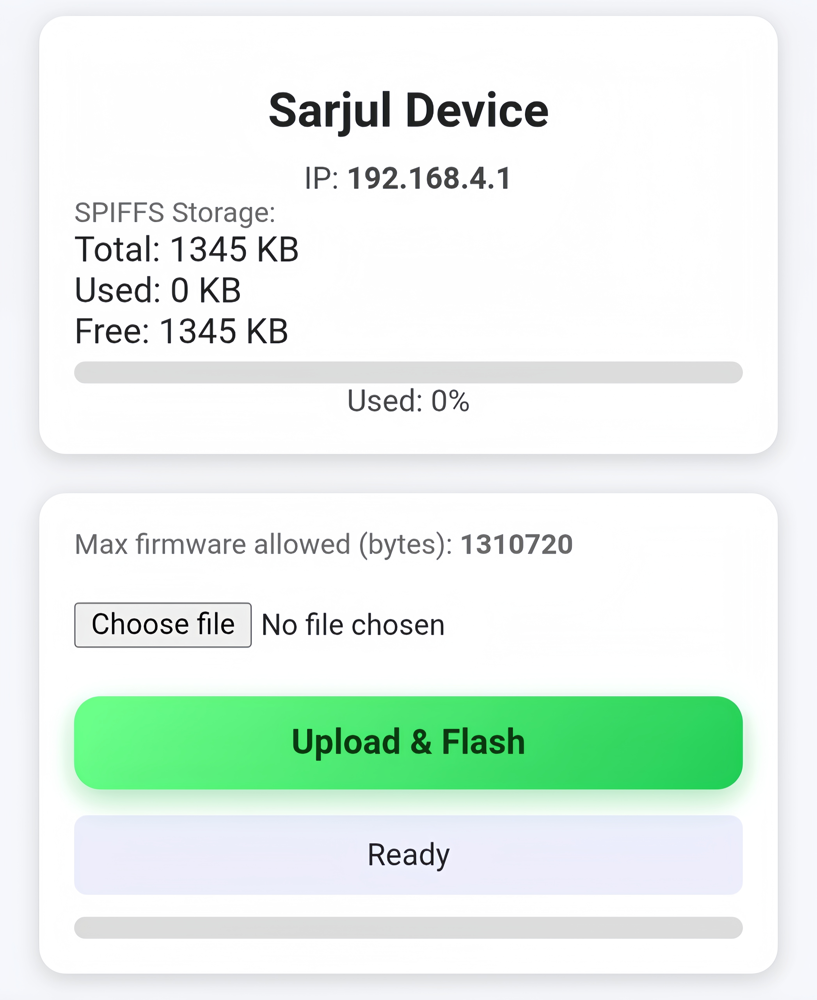

# 🚀 ESP32 OTA Web Updater – Sarjul Device UI

A professional wireless firmware updater for ESP32 with a modern web interface.

This system lets you upload firmware files directly from browser and flash them instantly without USB connection.

---

## 🌐 Web Interface Preview



---

## 📌 Overview
This project creates a WiFi access point and hosts a built-in web dashboard where users can upload firmware files safely.

After upload:
- firmware writes to flash
- device verifies
- device reboots automatically

---

## ✨ Features

- Wireless OTA flashing  
- Premium modern UI  
- Real-time progress display  
- Storage info viewer  
- Max firmware size indicator  
- Safe flashing system  
- Auto reboot  

---

## 📡 Device Access

After boot device creates WiFi network:

```
SSID: Sarjul
Password: 12345678
```

Open browser:

```
192.168.4.1
```

---

## 📂 Project Structure

```
ESP32-OTA/
│
├── OTA.ino
├── README.md
└── assets/
     └── ui.png
```

---

## ⚙️ Installation

1. Open Arduino IDE  
2. Install ESP32 board package  
3. Select board → ESP32 Dev Module  
4. Upload code once via USB  

After that all updates are wireless.

---

## 🔄 Firmware Update Steps

1. Connect to device WiFi  
2. Open browser  
3. Enter IP address  
4. Select firmware file  
5. Click **Upload & Flash**  
6. Wait for reboot  

---

## 🧠 System Working Logic

```
Boot → AP Mode → Web Server → Upload → Flash → Restart
```

---

## 🛡 Safety Notes

- Never power off during update  
- Only upload correct firmware  
- Stable connection required  

---

## 🎯 Customization

You can modify easily:

| Item | Where |
|-----|------|
WiFi Name | setup() |
Password | setup() |
UI Text | HTML code |
LED Pin | define section |

---

## 📜 License
Free for personal and commercial use.

---

## 👨‍💻 Developer
Sarjul
